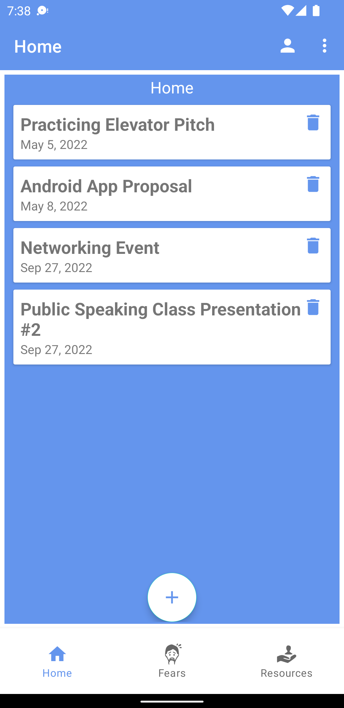

# Welcome to Anxiety Helper!

This is a mobile application developed in *Kotlin / Android Studio*. Ths app uses therapy-based & mindfulness methods to help users navigate and overcome anxiety IN THE MOMENT. Anxiety Helper utilizes journal entries with tailored quesions that allow users to get in touch with their **thoughts, emotions, and attitudes**.

        

I hope you enjoy this app as much as I did creating it. It is a pleasure & an honor to help YOU overcome fear once and for all 😁
